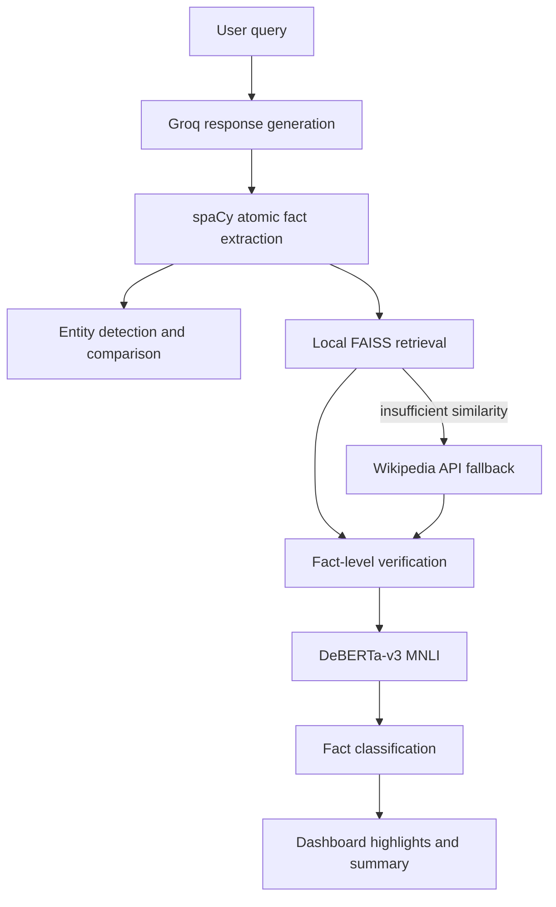

# HaluCheck Architecture

## Runtime flow

## Module ownership

- `app.py`: Streamlit entry point, Groq request, progress state, and dashboard invocation.
- `extraction/`: spaCy sentence parsing, atomic-fact decomposition, and named entities.
- `services/retriever.py`: local-first evidence orchestration, cache, fallback policy, and retrieval timings.
- `services/vector_store.py`: persistent FAISS index and aligned metadata.
- `services/wikipedia_service.py`: MediaWiki search/article requests, normalization, caching, chunk ranking, and timing.
- `verification/`: DeBERTa adapter, evidence-level NLI aggregation, and fact-level classifications.
- `services/analysis_service.py`: single application pipeline joining extraction, retrieval, and verification.
- `evaluation/`: HaluEval loader, benchmark runner, comparative configurations, metrics, and reports.
- `visualization/dashboard.py`: response highlighting, verdict, evidence, and developer details.

## Evidence policy

Local FAISS is searched first. Wikipedia is called only when local evidence is disabled, absent, or below `LOCAL_SIMILARITY_THRESHOLD`. Wikipedia results are cached by normalized query and article content; repeated fact queries are deduplicated in batch retrieval. Retrieval errors degrade to available local evidence or an empty evidence list and are surfaced in the analysis comparison metadata.

## Model reuse

The sentence-transformer embedder is cached on each `EvidenceRetriever` instance. Wikipedia search and article methods are cached. The DeBERTa tokenizer/model are process-cached by model name in `verification.nli_verifier._load_model`.
